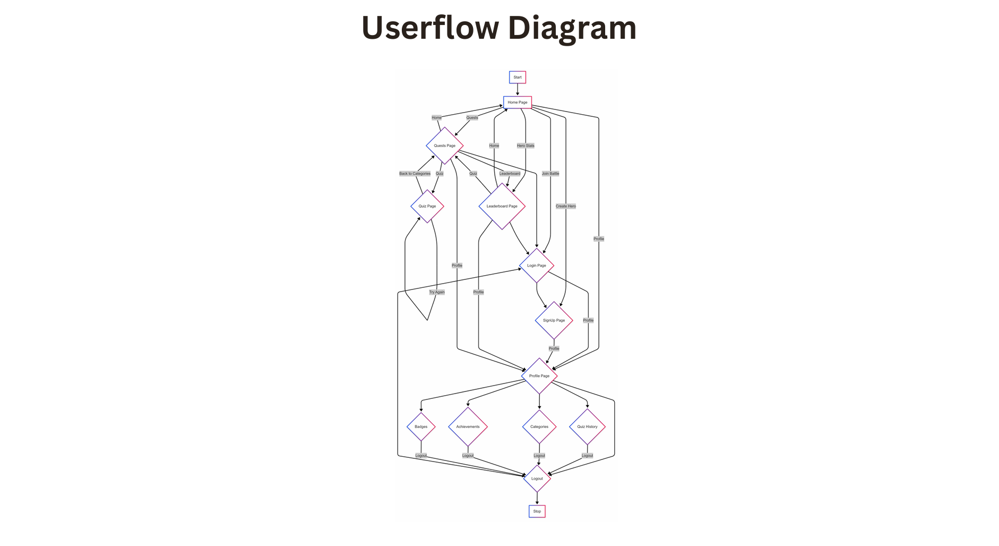

# SkillUp

A gamified educational platform designed to make learning fun and engaging! Challenge yourself with quizzes, track your progress, earn achievements, and compete on the leaderboard—all with a modern, game-inspired interface.

---

## 🗺️ User Flow Diagram

Below is the user flow diagram illustrating the navigation and core interactions within the app:



---

## 🚀 Features
- **Authentication System:** Secure login and registration for users.
- **Quiz System:** Participate in quizzes, track your score, and progress.
- **Profile Management:** View and edit your profile, track XP, level, and streaks.
- **Leaderboard:** Compete with others and climb the ranks.
- **Achievements:** Unlock badges and rewards for milestones.
- **Game HUD:** Visualize your level, XP, streak, and achievements in real-time.
- **Quest Journey:** Follow your learning journey with a hero section and quest visualization.
- **Responsive UI:** Modern, animated, and mobile-friendly interface.

---

## 📁 Project Structure
```
/assets      # Media files (images, icons, diagrams)
/css         # Styling (CSS, animations)
/data        # Data storage (JSON, user/quiz data)
/js          # JavaScript functionality (auth, quiz, profile, leaderboard, config)
/pages       # Additional HTML pages (quiz, profile, etc.)
/index.html  # Landing page
```

---

## 🛠️ Getting Started
1. **Clone the repository:**
   ```bash
   git clone <repo-url>
   ```
2. **Open `index.html` in your browser.**
3. **Enjoy learning and competing!**

---

## 🙌 Credits
- Built with ❤️ by the SkillUp team:
  - Abhishek Tiwary
  - Prachi Goyal
  - Abhay Kumar
  - Vishal Yadav
- UI inspired by modern games, using Font Awesome icons and CSS animations.

---

For questions or contributions, please open an issue or submit a pull request!

    QuizResults --> Dashboard
    ViewProfile --> EditProfile[Edit Profile]
    EditProfile --> Dashboard
    ViewAchievements --> Dashboard
    ViewLeaderboard --> Dashboard
    LogOut --> Start
```

---


## 🛠️ Tech Stack
- **Frontend:** HTML5, CSS3 (with animations), JavaScript (ES6)
- **Icons:** Font Awesome
- **Backend:** Firebase Realtime Database & Authentication

---

## ⚙️ Setup Instructions
1. **Clone the repository:**
   ```bash
   git clone https://github.com/yourusername/skillup.git
   ```
2. **Configure Firebase:**
   - Update `js/config.js` with your Firebase project credentials.
3. **Open `index.html` in your browser.**
4. **(Optional) Deploy to Netlify, Vercel, or Firebase Hosting.**

---

## 🙏 Credits
- UI inspired by modern gamification platforms.
- Built with [Firebase](https://firebase.google.com/) and [Font Awesome](https://fontawesome.com/).

---

## 📄 License
MIT
  - Personal statistics
  - Achievement showcase
  - Progress visualization

- **Leaderboards**
  - Real-time rankings
  - Time-based filters
  - Competition tracking

## Setup Instructions

1. **Firebase Setup**
   - Create a new Firebase project
   - Enable Authentication and Firestore
   - Copy your Firebase config to `js/config.js`

2. **Local Development**
   - Clone the repository
   - Update Firebase configuration
   - Open `index.html` in a browser

3. **Firebase Database Structure**
   ```
   /users
     ├── userId
     │   ├── email
     │   ├── username
     │   ├── points
     │   ├── badges[]
     │   ├── trophies[]
     │   └── quizzesTaken[]
     │
   /quizzes
     ├── quizId
     │   ├── title
     │   ├── description
     │   ├── difficulty
     │   ├── timeLimit
     │   └── questions[]
     │
   /leaderboard
     └── entries[]
   ```

## Team Members

- Frontend Developer (Member A) - Abhishek Tiwary
  - Homepage and Quiz interface
  - UI components and animations
  - Leaderboard and its functionality

- Backend Developer (Member B) - Abhay Kumar
  - Firebase integration
  - Database structure
  - Authentication system

- Frontend Developer (Member C) - Prachi
  - Login/Signup pages
  - Profile interface
  - Navigation system

- UI/Integration Specialist (Member D) - Vishal Yadav
  - UI design
  - Handled Firebase console

## Day 1 Deliverables ✅

- [x] Basic project structure
- [x] Homepage layout
- [x] Authentication pages
- [x] Quiz interface
- [x] Profile page structure
- [x] Firebase configuration
- [x] Responsive design
- [x] Navigation system

## Next Steps

1. Create quiz data structure
2. Add real-time quiz functionality
3. Implement scoring system
4. Develop achievement system
5. Create leaderboard functionality
